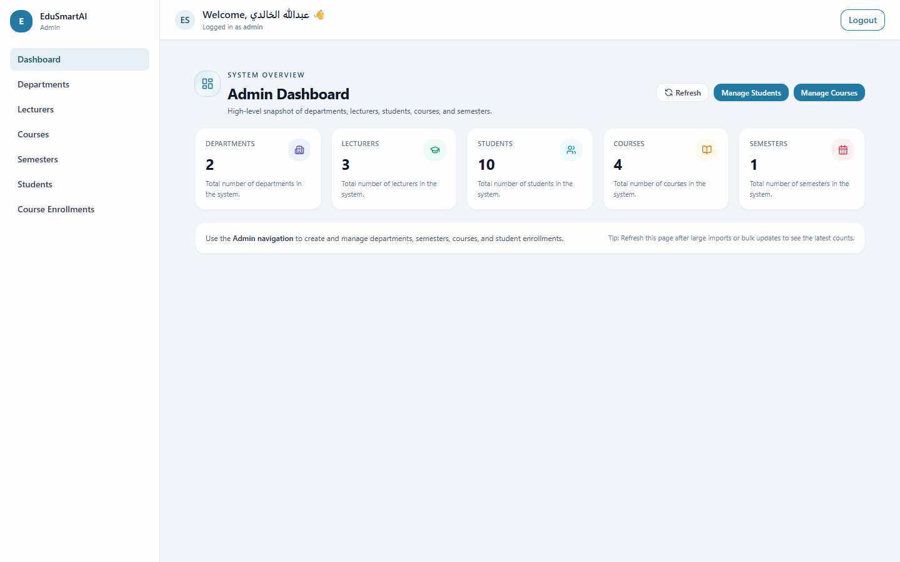
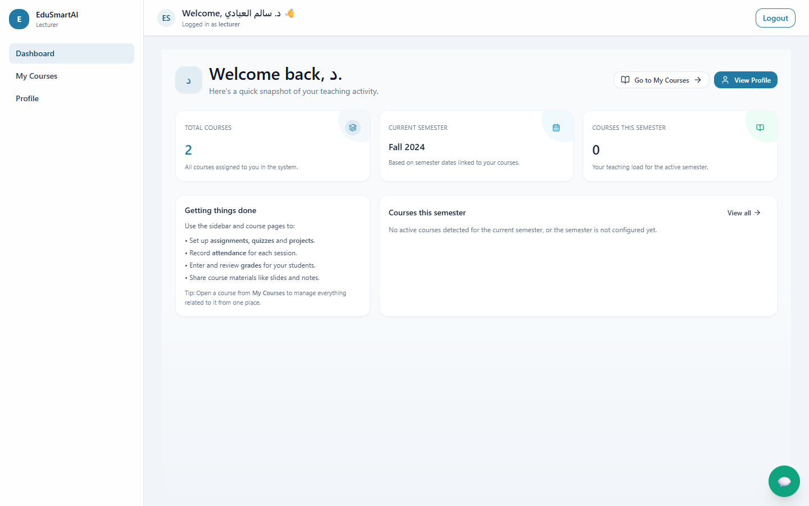
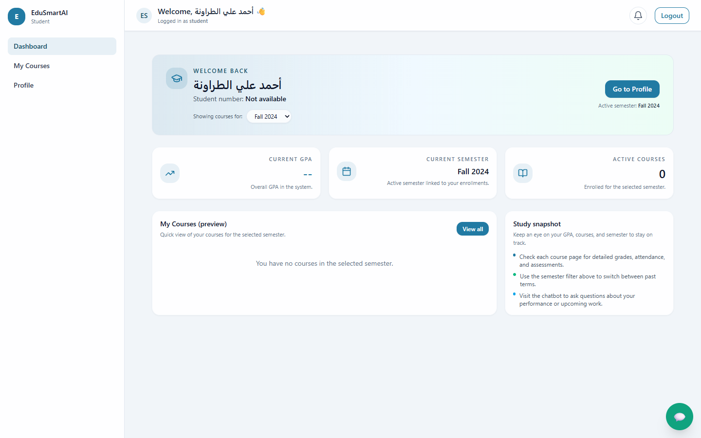
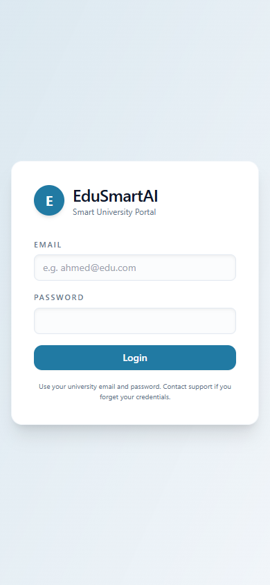
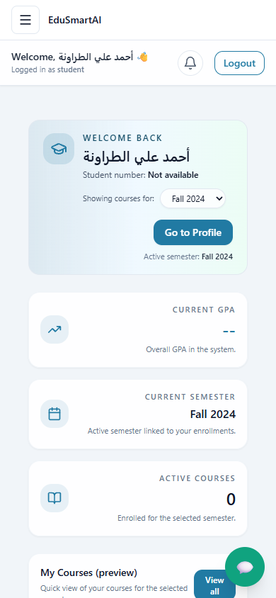
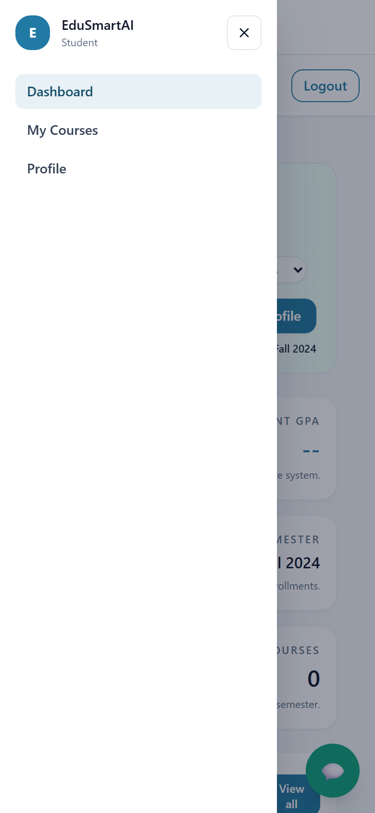
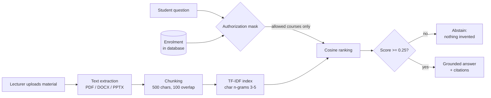
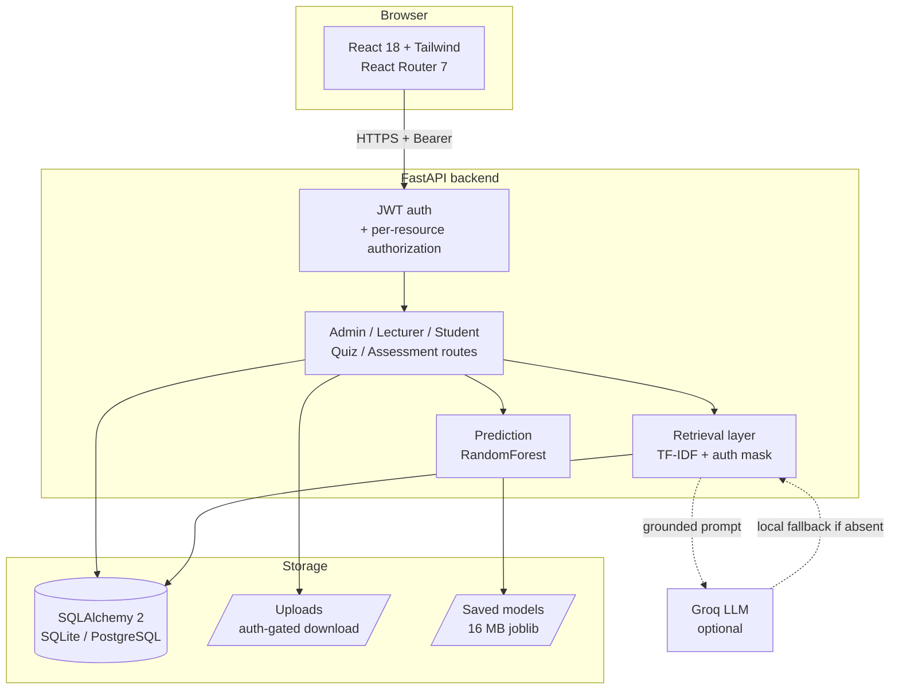
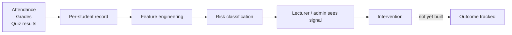

<div align="center">


**An academic management platform that helps universities notice a struggling student while there is still time to help them.**

</div>

[](https://github.com/bahaaed07706/EduSmartAI/actions/workflows/ci.yml)
[](https://www.python.org/)
[](https://nodejs.org/)
[](LICENSE)

> **Live demo — partial.** The frontend is deployed to Vercel:
> **https://edusmartai-frontend.vercel.app**. It renders the interface, but the
> demo is **not yet functional end to end** — login, dashboards, quizzes and the
> assistant all need the API, and the backend is not deployed yet (Render
> provisioning is pending). Deployment configuration for both halves is
> committed: [`render.yaml`](render.yaml) and
> [`edusmartai-frontend/vercel.json`](edusmartai-frontend/vercel.json). See
> [docs/deployment-decision.md](docs/deployment-decision.md). This note will be
> updated to "fully live" once the backend is up and verified end to end.

---

## The problem

Students who fail a course rarely fail suddenly. The signals appear weeks
earlier: attendance drops, material goes unopened, an early assignment comes
back weak. Those signals exist — but they live in different systems, and nobody
assembles them until final grades are submitted. By then it is too late to act.

EduSmartAI puts those signals in one place and adds two things: a risk
classification from a trained model, and an assistant that answers a student's
questions using only the course material they are actually enrolled in.

## What it does

**Administrators** manage the academic structure — departments, semesters,
courses, lecturers, enrolments. Records are never destroyed: users are
deactivated, courses archived, enrolments withdrawn. Deleting something with
history attached returns a clear refusal rather than silently dropping rows.

**Lecturers** run their own courses: attendance, grades, materials, auto-graded
quizzes, and file-submission assessments with manual grading. The quiz results
page shows per-question difficulty, so a lecturer can see which concept the
class missed rather than only who scored badly.

**Students** see their own record, attempt quizzes with immediate results,
submit assessment files, and ask the assistant about their material.

## Screenshots

Captured from the running application with synthetic demo data.

| Admin | Lecturer | Student |
|---|---|---|
|  |  |  |

At 390px — a designed mobile layout, not a compressed desktop one. The last
image is the accessible navigation drawer (focus-trapped, Escape to close,
backdrop dimming the page behind it):

| Login | Student | Navigation drawer |
|---|---|---|
|  |  |  |

## The AI assistant, and what "RAG" means here

Many projects describe context injection as retrieval-augmented generation.
This one did too, until an audit caught it — the chatbot was pasting material
*titles* into the prompt and calling it retrieval. That was replaced with actual
retrieval.



Two details matter more than the ranking method.

**The authorization mask is applied before scoring, not after.** The set of
courses a user may retrieve from is derived from the database — enrolment for
students, ownership for lecturers, empty for admins — and restricts candidates
before any similarity is computed. A student cannot surface content from a
course they are not enrolled in, regardless of how the question is phrased.
There are tests for exactly this, including prompt-injection attempts.

**It abstains.** Below a cosine score of 0.25 the system declines rather than
answering from weak evidence.

Retrieval is lexical — TF-IDF over character n-grams, not dense embeddings.
That is deliberate: the corpus is mixed Arabic and English, and Arabic is
morphologically rich enough that word-level tokenisation retrieves poorly. The
trade-off is that synonyms sharing no characters will not match. On a 12-query
bilingual evaluation set, precision@1, recall@3 and MRR are all 1.00 — a set
small enough that the honest reading is "the mechanism works," not "retrieval is
solved."

Details in [docs/rag.md](docs/rag.md).

## Machine learning, and an important caveat

| Model | Predicts | Accuracy | ROC-AUC | n |
|---|---|---|---|---|
| AXI | Performance class (3-way) | 0.7917 | 0.9219 | 96 |
| OULAD | Pass / fail | 0.9790 | 0.9937 | 2811 |

**The OULAD figure is inflated by target leakage and must not be read as
reliable early risk prediction.** A `Pass_rate` feature derived from the outcome
leaked into training, so the model is largely reading the answer rather than
predicting it. Presenting 97.9% as an early-warning capability would be wrong.
Fixing it properly — rebuilding features with a strict temporal cutoff — is the
top open item on the [roadmap](docs/roadmap.md). The number will fall
substantially, and that is the point.

Also found and fixed: a **training/serving skew**. `Days_Active` was computed as
`max(date)` during training but as a count of distinct days at inference, so the
deployed model was reading a feature that meant something different from the one
it learned. That class of defect produces quietly wrong predictions with no
error anywhere, which is why
[`scripts/evaluate_models.py`](scripts/evaluate_models.py) exists as a
reproducible, read-only check. Full detail in
[docs/ml-evaluation.md](docs/ml-evaluation.md).

## Architecture



The chatbot degrades gracefully: with no API key configured it falls back to
local responses and the API reports `ai_powered: false` rather than claiming
capability it does not have.

## How a risk signal becomes an action



The dashed step is honest: the product surfaces the signal but does not record
what was done about it. Closing that loop is the highest-value institutional
feature not yet built.

## Security

Authorization is enforced per resource, not per role. Being a lecturer is not
sufficient to read a course — you must own it.

- Quiz option correctness (`is_correct`) is **never** serialised to a student
  before submission.
- A student's submitted `file_url` must reference a file that student uploaded,
  so a submission cannot point at course material or another student's folder.
- Withdrawn students lose access to course material immediately.
- Uploads are never publicly served. Download runs an ownership check first,
  then a path-traversal check.
- The application refuses to start on a weak or default `JWT_SECRET`, and
  refuses to start in production with a wildcard CORS origin.
- Rate limiting caps login attempts, chatbot queries and uploads.
- No secret is logged, not even a prefix.

An audit of this project found six critical issues, including an IDOR that
leaked student PII, grades and predictions to any authenticated lecturer. All
are fixed with regression tests. See [docs/security.md](docs/security.md).

## Verified results

Every number here comes from a command in this repository.

| Check | Result |
|---|---|
| Backend tests | 103 passing, on Windows and Linux |
| Lint (ruff) | clean |
| Production build | compiles |
| Accessibility (axe-core, WCAG 2.0/2.1/2.2 A+AA) | **0 violations**, 6 pages × 3 viewports |
| Responsive audit | **0 issues**, 9 pages × 5 breakpoints (360–1440) |
| Production dependency audit | 2 moderate, down from 59 (2 critical, 29 high) |
| Secret scan | clean |
| Migration idempotency | verified twice on a database copy |

Accessibility and responsiveness are measured, not asserted:
[`scripts/a11y-audit.js`](scripts/a11y-audit.js) runs axe-core against the real
application, and [`scripts/responsive-audit.js`](scripts/responsive-audit.js)
measures overflow, touch-target size and clipped text inside the page.

## Quick start

Requires Python 3.12 and Node 24.

```bash
git clone https://github.com/bahaaed07706/EduSmartAI.git
cd EduSmartAI/BAHAAW
```

**Backend:**

```bash
cd backend
python -m venv venv && source venv/Scripts/activate
pip install -r requirements.txt
cp .env.example .env
```

Edit `.env` — the app will not start without a strong `JWT_SECRET`:

```bash
python -c "import secrets; print(secrets.token_urlsafe(48))"
```

Seeding a fresh database also requires `SEED_ADMIN_PASSWORD`,
`SEED_LECTURER_PASSWORD` and `SEED_STUDENT_PASSWORD`, 12+ characters each.
There are no default passwords, by design.

```bash
python migrate_schema.py
python seed_data.py          # fresh databases only — never over existing data
uvicorn main:app --reload
```

**Frontend:**

```bash
cd edusmartai-frontend
npm ci
REACT_APP_API_BASE_URL=http://127.0.0.1:8000 npm start
```

Health checks: `/health` for liveness, `/ready` to confirm the database responds
and the models deserialised.

## Documentation

| Document | What it covers |
|---|---|
| [product-positioning.md](docs/product-positioning.md) | Who this is for; ready vs. roadmap |
| [roadmap.md](docs/roadmap.md) | What is next, with effort and rationale |
| [rag.md](docs/rag.md) | Retrieval design and evaluation |
| [ml-evaluation.md](docs/ml-evaluation.md) | Model metrics and the leakage problem |
| [security.md](docs/security.md) | Authorization model and audit findings |
| [design-system.md](docs/design-system.md) | Tokens, components, accessibility rules |
| [deployment-decision.md](docs/deployment-decision.md) | Why Render, and why not serverless |
| [current-state.md](docs/current-state.md) | Verified state, branch, blockers |

## Honest limitations

- **Not yet deployed.** Architecture decided, configuration written, execution
  pending.
- **OULAD accuracy is leakage-inflated** and unusable for early prediction.
- **LLM answer quality is unverified** — no API key has been available. Only the
  retrieval layer and the local fallback are tested.
- **The RAG evaluation set is 12 queries** — enough to demonstrate the
  mechanism, not enough to claim retrieval quality.
- **Accessibility covers 6 of 37 pages.** Those six pass cleanly; the rest are
  unaudited.
- **RTL is partial.** The interface uses logical properties but has no language
  switcher, so full mirroring is unverified.
- **Two moderate advisories remain** in `quill`/`react-quill`, needing a
  breaking upgrade.
- **PostgreSQL support is implemented but unexercised** against a real instance;
  the test suite runs on SQLite.

## Contributing

See [CONTRIBUTING.md](CONTRIBUTING.md). One rule up front: no change is "done"
without evidence — a test, command output, or a screenshot.

## License

MIT — see [LICENSE](LICENSE).

## Author

Built by [@bahaaed07706](https://github.com/bahaaed07706) as a graduation
project.

---

<div dir="rtl">

## نبذة بالعربية

**EduSmartAI** منصة لإدارة العملية الأكاديمية تساعد الجامعات على ملاحظة الطالب
المتعثر بينما ما زال الوقت متاحًا لمساعدته.

تجمع المنصة الحضور والدرجات ونتائج الاختبارات في سجل واحد لكل طالب، وتضيف إليه
تصنيفًا لمستوى الخطر الأكاديمي، ومساعدًا ذكيًا يجيب من مواد المقرر المسجَّل فيه
الطالب فقط — مع ذكر المصدر، ومع الامتناع عن الإجابة عند غياب دليل كافٍ.

ثلاثة أدوار: **المشرف** يدير الهيكل الأكاديمي دون أن تُحذف السجلات نهائيًا،
و**المحاضر** يدير مقرراته واختباراته وتقييماته، و**الطالب** يتابع سجله ويؤدي
اختباراته ويقدّم تكليفاته.

**ملاحظة مهمة عن النتائج:** دقة نموذج OULAD البالغة 97.9% **مضخَّمة بسبب تسرّب
الهدف (target leakage)**، ولا يصح تقديمها كتنبؤ مبكر موثوق. المشروع يوثّق هذا
القيد بوضوح بدل إخفائه، وإصلاحه هو البند الأول في خطة التطوير.

الواجهة تعمل من 360 بكسل حتى 1440 بكسل دون أي مشكلة مقاسة، وتجتاز فحص إمكانية
الوصول axe-core بصفر مخالفات على الصفحات المفحوصة.

</div>
