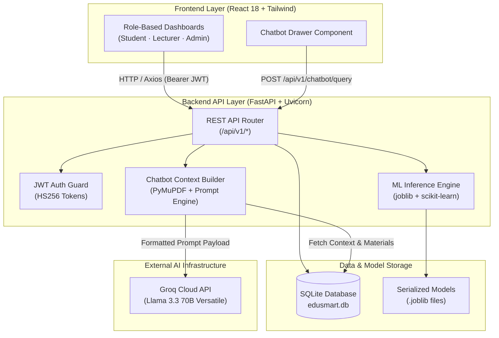

# EduSmartAI — AI-Powered Educational Management Platform

An educational management platform that integrates role-based academic administration, machine learning-driven student performance prediction, and a context-aware AI chatbot. EduSmartAI helps institutions identify academic risk indicators early, provides lecturers with student performance insights, and assists students through automated academic guidance—built with FastAPI and React 18.

---

## Why This Project Matters

In many educational environments, academic risk indicators are identified late in the semester after assessments are finalized. Attendance metrics, assessment scores, and online platform participation often exist in isolated spreadsheets or separate systems without a unified analytical view.

EduSmartAI addresses these challenges by:

- **Predicting academic performance early** using pre-trained Random Forest classification models that analyze learning behavior and historical assessment patterns.
- **Centralizing academic records**—including grades, attendance, course materials, and engagement metrics—into a unified system accessible to students, lecturers, and administrators.
- **Providing a context-aware AI chatbot assistant** that builds dynamic prompts using student profiles, course enrollment, grades, attendance logs, and uploaded course materials.
- **Assisting lecturers with risk detection** by surfacing per-student prediction outputs and behavioral classifications in class management views.

---

## Core Features

### Role-Based Access Control

| Role | Capabilities |
|---|---|
| **Student** | View enrolled courses, monitor grades and attendance records, review AI prediction results (OULAD and AXI), access uploaded course materials, and query the AI chatbot. |
| **Lecturer** | Manage assigned courses, record student grades and attendance, execute ML predictions for enrolled students, view risk indicators, upload course materials, and query the chatbot with student context. |
| **Admin** | Manage academic departments, courses, user accounts (students, lecturers, admins), semesters, and course enrollment records across the platform. |

### Machine Learning Performance Prediction

- **OULAD Risk Prediction Model:** Binary classification model predicting module pass/fail outcomes using 7 features derived from the Open University Learning Analytics Dataset. Preprocessed with StandardScaler and trained using Random Forest.
- **AXI Behavioral Engagement Model:** Three-class classification model categorizing student engagement into High (H), Medium (M), or Low (L) categories using 6 behavioral metrics from the xAPI-Edu-Data dataset. Preprocessed with StandardScaler and trained using Random Forest.
- **Inference Integration:** Predictions are evaluated on demand per student and course, stored in the local SQLite database, and rendered across user dashboards.

### Chatbot Assistant with Context Injection

- **Groq API Integration:** Connects to the Groq API utilizing the `llama-3.3-70b-versatile` model.
- **Dynamic Context Assembly:** Automatically builds role-specific system prompts containing user profiles, course records, grades, attendance stats, and ML prediction scores.
- **Course Material Parsing:** Extracts plain text from uploaded course documents (PDF, DOCX, PPTX) via PyMuPDF and injects material excerpts into the prompt payload for course-grounded responses.
- **Graceful Fallback:** If `GROQ_API_KEY` is not present in the environment configuration, the system returns template-based local fallback responses without breaking execution.

---

## Architecture Overview



---

## Tech Stack

| Layer | Technologies |
|---|---|
| **Frontend** | React 18.3, React Router 7.9, Tailwind CSS 3.4, Axios 1.13, Lucide React, React Quill, DOMPurify |
| **Backend** | Python 3.10+, FastAPI 0.109, Uvicorn 0.27, SQLAlchemy 2.0, Pydantic 2.5, python-jose (JWT), Passlib (bcrypt) |
| **AI / ML** | scikit-learn 1.4, pandas 2.1, NumPy 1.26, joblib 1.3 |
| **Chatbot & Utility** | Groq Python SDK 0.4, PyMuPDF 1.23, python-docx 1.1, python-pptx 0.6 |
| **Database** | SQLite (local development file: `edusmart.db`) |
| **Testing & Tooling** | python-dotenv, pytest 8.0, httpx 0.26 |

---

## Repository Structure

```
EduSmartAI/
├── backend/                    # FastAPI REST application
│   ├── main.py                 # Application entrypoint, CORS, route inclusion, model loading
│   ├── config.py               # Environment configuration (Pydantic settings)
│   ├── database.py             # SQLAlchemy engine setup and session management
│   ├── models.py               # Database ORM models (User, Course, Grade, Attendance, StudentFeature, etc.)
│   ├── schemas.py              # Pydantic data validation schemas
│   ├── auth.py                 # Password hashing, JWT token generation, role verification
│   ├── seed_data.py            # Local database populator with initial records and predictions
│   ├── requirements.txt        # Backend dependencies
│   ├── .env.example            # Environment template file
│   ├── utils/
│   │   └── pdf_extractor.py    # Text extraction utility for PDF, DOCX, and PPTX documents
│   └── routes/
│       ├── auth_routes.py      # User authentication endpoints
│       ├── student_routes.py   # Student portal data endpoints
│       ├── lecturer_routes.py  # Lecturer portal and course management endpoints
│       ├── admin_routes.py     # Administrative CRUD management endpoints
│       ├── prediction_routes.py # ML model inference endpoints
│       ├── chatbot_routes.py   # Context builder and Groq API chatbot endpoints
│       ├── file_routes.py      # Course material upload and download handling
│       └── skeleton_routes.py  # System health check and utility endpoints
│
├── edusmartai-frontend/        # React single-page client application
│   ├── src/
│   │   ├── api/                # Axios client configuration and modular API requests
│   │   ├── components/         # Reusable UI components (Layout, UI controls, Chatbot drawer)
│   │   ├── context/            # AuthContext for global authentication and token storage
│   │   ├── hooks/              # Custom React hooks (useAuth, useChatbot, useNotifications)
│   │   ├── pages/              # Role-specific application views (Admin, Lecturer, Student)
│   │   └── routing/            # Router setup with ProtectedRoute and RoleRoute guards
│   ├── package.json            # Frontend dependency manifest
│   └── .env.example            # Frontend environment variable template
│
├── Saved_Models/               # Serialized scikit-learn models and scalers
│   ├── oulad_model_fixed.joblib      # OULAD Random Forest classification model
│   ├── oulad_scaler_fixed.joblib     # OULAD StandardScaler object
│   ├── axi_rf_model.joblib           # AXI Random Forest classification model
│   └── axi_scaler.joblib             # AXI StandardScaler object
│
├── Training_Data/              # Dataset files and OULAD model training notebook
│   ├── OULAD_Dataset1_Refactored.ipynb
│   ├── assessments.csv, courses.csv, studentAssessment.csv,
│   │   studentInfo.csv, studentRegistration.csv, vle.csv
│   └── (studentVle.csv — excluded due to file size, downloadable separately)
│
├── AXI_Training/               # xAPI-Edu-Data training set and notebook
│   ├── xAPI-Edu-Data.csv
│   └── xAPI_Edu_Data_Optuna_+_Logistic_Regression(1) (1).ipynb
│
├── .gitignore                  # Git tracking exclusion configuration
└── README.md                   # Primary repository documentation
```

---

## Machine Learning Layer

The prediction subsystem consists of two pre-trained Random Forest models serialized with `joblib` and loaded during FastAPI backend initialization (`main.py` lifespan handler).

> **Measured performance and caveats: [`docs/ml-evaluation.md`](docs/ml-evaluation.md).**
> Held-out results — AXI: accuracy 0.792, ROC-AUC 0.922 (n=96). OULAD: accuracy 0.979,
> ROC-AUC 0.994 (n=2,811) — **but the OULAD figure is inflated by target leakage**
> (`Pass_rate` encodes course completion), so it must **not** be presented as
> early-warning accuracy. Reproduce with `python scripts/evaluate_models.py`.

### 1. OULAD Model — Student Risk Prediction

Predicts whether a student is likely to pass or fail a course based on Virtual Learning Environment (VLE) interaction and non-exam assessment data.

- **Dataset Source:** Open University Learning Analytics Dataset (OULAD).
- **Target Leakage Prevention:** Final exam scores are explicitly excluded during feature engineering to ensure predictions rely solely on ongoing course metrics.
- **Input Features (7):**
  - `Weighted_grade`: Cumulative weighted assessment score prior to final exams.
  - `Pass_rate`: Historical module pass rate.
  - `Score_tma`: Average score on Tutor-Marked Assessments.
  - `Score_cma`: Average score on Computer-Marked Assessments.
  - `Sum_click`: Total count of VLE resource interactions.
  - `Days_Active`: Count of unique active days on the VLE.
  - `num_of_prev_attempts`: Count of prior attempts at the module.
- **Output:** Binary classification (`1` for predicted pass, `0` for predicted failure) alongside class probability estimates.

### 2. AXI Model — Behavioral Engagement Classification

Classifies a student's behavioral engagement level into three categories.

- **Dataset Source:** xAPI-Edu-Data dataset.
- **Input Features (6):**
  - `raised_hands`: Number of times the student raised their hand in class.
  - `visited_resources`: Count of digital learning resource accesses.
  - `announcements_view`: Count of announcement views.
  - `discussion`: Count of discussion forum participations.
  - `absence_days`: Categorical indicator (`Under-7` or `Above-7` days absent).
  - `parent_satisfaction`: Categorical indicator (`Good` or `Bad`).
- **Output:** Three-class classification (`H` for High, `M` for Medium, `L` for Low engagement) with per-class probabilities.

---

## Chatbot Subsystem & Context Injection

The chatbot implementation in `backend/routes/chatbot_routes.py` connects to the Groq API to query `llama-3.3-70b-versatile`.

### Context Assembly Process

1. **User Identity & Role Check:** Verifies JWT credentials and determines whether the requester is a Student or Lecturer.
2. **Database Querying:** Retrieves student profile details, enrolled courses, historical grades, attendance records, stored ML prediction outputs, and behavioral attributes.
3. **Course Material Text Extraction:** When querying within a course context, text content extracted from course materials (via `backend/utils/pdf_extractor.py`) is included in the system prompt payload.
4. **LLM Query Dispatch:** Sends the structured system prompt and message history to the Groq client.
5. **Fallback Mechanism:** If `GROQ_API_KEY` is undefined or blank in `.env`, the endpoint returns structured template fallback responses with a warning log, ensuring the backend remains functional without an API key.

---

## Local Setup & Run Instructions

### Prerequisites

- Python 3.10–3.12 (3.12 recommended; `numpy==1.26.3` does not build on 3.13+)
- Node.js 18 or higher
- npm 9 or higher
- A strong `JWT_SECRET` (≥ 16 chars) — the backend refuses to start without one

### 1. Backend Setup

```bash
# Navigate to backend directory
cd backend

# Create virtual environment
python -m venv venv

# Activate virtual environment
# Windows PowerShell:
.\venv\Scripts\Activate.ps1
# macOS / Linux:
source venv/bin/activate

# Install required dependencies
pip install -r requirements.txt

# Create environment configuration file
cp .env.example .env
# Edit backend/.env: set a strong JWT_SECRET (required) and an optional GROQ_API_KEY.
# Generate a secret with:
#   python -c "import secrets; print(secrets.token_urlsafe(48))"

# Populate local database with seed data
python seed_data.py

# Apply the normalized schema (departments, semesters, notifications) and
# backfill student/lecturer numbers, department links, and final grades.
# This migration is additive and idempotent — safe to re-run.
python migrate_schema.py

# Start the FastAPI development server
uvicorn main:app --reload --host 127.0.0.1 --port 8000
```

To run the backend tests: `pytest -q` (from the `backend` directory).

FastAPI OpenAPI documentation is accessible at `http://localhost:8000/docs`.

### 2. Frontend Setup

```bash
# Navigate to frontend directory
cd edusmartai-frontend

# Create environment configuration file
cp .env.example .env

# Install frontend dependencies
npm install

# Start the React development server
npm start
```

The frontend application will be running at `http://localhost:3000`.

---

## Safety & Exclusion Policies

The following files and paths are excluded from version control via `.gitignore` to prevent secret leakage and keep the repository weight manageable:

- `backend/.env` — Contains private keys and local configurations.
- `backend/edusmart.db` — Local development database file.
- `Training_Data/studentVle.csv` — Large dataset file (~454 MB); must be downloaded independently if re-running training notebooks.
- `.claude/` — Local IDE settings.
- `node_modules/`, `venv/`, `__pycache__/`, `build/`, `dist/` — Environment and build artifacts.

---

## Current Technical Limitations

Stated honestly so the implemented scope is clear:

- **Quiz & assessment engine is implemented and tested** (interactive MCQ quizzes with server-side auto-grading; file-submission assessments with manual grading). Verified end-to-end in the browser (attempt → auto-save → submit → auto-graded result). Option correctness is never sent to students before they submit. Two lecturer/student API-client methods remain intentionally unused (no page calls them).
- **Chatbot uses query-based retrieval (RAG) with source citations** — see [`docs/rag.md`](docs/rag.md). Retrieval is **lexical** (TF-IDF over character n-grams), not dense/semantic embeddings. Course-material access is authorization-filtered *before* ranking, so a student can only ever be grounded in materials from courses they are enrolled in. Measured recall@3 = 1.00, MRR = 1.00 on a small bilingual labelled set (n=5 — demonstrates the mechanism, not production-scale quality). It requires a valid `GROQ_API_KEY` (`gsk_...`) for LLM answers; without one it returns local, data-grounded fallback responses and never exposes configuration. **Live-provider answer quality and citation-following remain unverified** (no key available).
- **Admin "delete" is non-destructive** — students/lecturers are deactivated, courses archived, enrollments withdrawn. Historical records (grades, attendance, features) are never physically removed.
- **Design system & accessibility:** see [`docs/design-system.md`](docs/design-system.md). Tokens, shared primitives, mobile navigation, and AA contrast fixes are in place (Admin dashboard went from 8 measured contrast failures to 0). **WCAG 2.2 AA is targeted and materially improved, not formally certified** — audits covered representative pages per role, not all 37 routes, and no automated axe-core/Lighthouse run was performed. RTL logical properties are in place but there is no language switcher yet, so full RTL mirroring is unverified.
- **Frontend dependency vulnerabilities:** `npm audit` reports 59 issues (2 critical, 29 high). **All trace to `react-scripts` (Create React App) build tooling** — `shell-quote`, `websocket-driver`, `@svgr/webpack`, `jest` — not to code shipped in the browser bundle. Note `react-scripts` is currently listed under `dependencies` instead of `devDependencies`, which is why build tooling appears even with `--omit=dev`. Fixing properly means migrating off CRA (e.g. to Vite); `npm audit fix --force` would break the verified build.
- **Semester dates are not seeded.** The migration creates a `Fall 2024` semester without start/end dates; an admin can set them via the Semesters page.
- **File-Based Database:** SQLite (`edusmart.db`), for local execution and demonstration, not high-concurrency production.
- Uploaded files are served **only** through authenticated, ownership-checked, traversal-safe endpoints (`GET /files/{id}/download` for course materials, `GET /submissions/{id}/download` for assessment submissions). There is no open static mount.
- Records created by automated E2E runs are flagged `is_test_data` rather than deleted, so demo data is never mistaken for real academic records.
- **Dataset Exclusion:** the raw OULAD `studentVle.csv` (~454 MB) is excluded; download manually to retrain.
- **Model version pinning:** models were trained with scikit-learn **1.7.2**; `requirements.txt` matches. AXI runtime uses argmax while the training notebook experimented with a P(H)≥threshold rule (a documented decision-policy difference, not a feature mismatch).
- **Test Coverage:** 37 backend tests (auth/IDOR, admin/lecturer CRUD, data-protection, quiz/assessment engine, ML golden, chatbot eval). `pip-audit` and automated security-review diff extraction fail on non-ASCII paths — run them in CI or an ASCII path.

---

## Future Roadmap

- **PostgreSQL Integration:** Replace SQLite with PostgreSQL for relational integrity and concurrent transaction support.
- **Dockerization:** Add `Dockerfile` definitions and `docker-compose.yml` for unified multi-container orchestration.
- **CI/CD Integration:** Implement GitHub Actions workflows for automated linting, type checking, and testing.
- **Expanded Test Coverage:** Build comprehensive API integration test suites and frontend component tests.
- **Vector Indexing:** Transition chatbot material context parsing to an indexed vector store.

---

## Author & Project Information

Developed as an AI and software engineering educational platform project demonstrating full-stack web development, machine learning model integration, and cloud LLM context injection.
