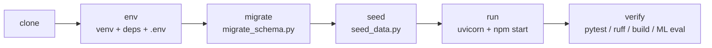

# Reproducibility

A precise, verified walkthrough for taking EduSmartAI from a fresh clone to a
running full stack, then reproducing every headline number this project claims.
Every command below exists in the repository — none is invented. Where a result
depends on data that is not shipped in git, that is stated explicitly rather than
glossed over.

Verified on 2026-07-24 against `main` at `8784f98`.

**Prerequisites:** Python **3.12** (numpy 1.26.3 does not build on 3.13+), Node
**24** (the lockfile was generated with the npm that ships with Node 24; Node 18
resolves a different tree and `npm ci` fails), and `git`.

## The pipeline at a glance



Each stage below is a link in that chain; run them in order.

## 1. Clone

```bash
git clone https://github.com/bahaaed07706/EduSmartAI.git
cd EduSmartAI
```

## 2. Environment

### Backend virtual environment and dependencies

```bash
cd backend
python -m venv venv
# Activate the virtual environment:
#   Linux / macOS:          source venv/bin/activate
#   Windows (PowerShell):   venv\Scripts\Activate.ps1
#   Windows (Git Bash):     source venv/Scripts/activate
pip install -r requirements.txt
```

`requirements.txt` pins `scikit-learn==1.7.2` deliberately: the `.joblib`
artifacts in `Saved_Models/` were pickled with that version, and a mismatch
raises `InconsistentVersionWarning` and risks silently wrong predictions.

`ruff` is **not** in `requirements.txt` — it is a lint-only tool. Install it
separately (this is exactly what CI does) when you intend to run the lint gate:

```bash
pip install ruff
```

### Configuration and secrets

```bash
cp .env.example .env
```

The application refuses to start on a weak or default `JWT_SECRET`, so generate a
strong one and paste it into `.env`:

```bash
python -c "import secrets; print(secrets.token_urlsafe(48))"
```

Seeding a fresh database additionally requires three seed passwords, **12+
characters each** — `seed_data.py` refuses to run without them and ships no
default passwords by design. Generate three values and set `SEED_ADMIN_PASSWORD`,
`SEED_LECTURER_PASSWORD` and `SEED_STUDENT_PASSWORD` in `.env`:

```bash
python -c "import secrets; print(secrets.token_urlsafe(18))"   # run three times
```

The remaining `.env.example` defaults work as-is for local development:
`DATABASE_URL=sqlite:///./edusmart.db`, local CORS origins, and an empty
`GROQ_API_KEY` (the chatbot falls back to local responses and honestly reports
`ai_powered: false` when no key is set).

## 3. Migrate

```bash
python migrate_schema.py
```

The migration is **additive and idempotent** — it adds departments, semesters,
notifications and FK columns, and backfills derived values. It contains no
`DROP`, is safe to re-run, and preserves existing row counts. On a fresh SQLite
file it creates the schema; on an existing one it only adds what is missing.

## 4. Seed

```bash
python seed_data.py          # fresh databases only — never over existing data
```

This populates synthetic demo data for all three roles. **Do not run it against a
database that already holds data** — seeding is for fresh setups only. A correctly
seeded database has these baseline counts: users=14, courses=4, enrollments=40,
grades=240, attendances=560, course_materials=6, student_features=40,
student_vle=363.

## 5. Run

Backend (from `backend/`, virtualenv active):

```bash
uvicorn main:app --reload
```

Liveness and readiness checks are available at `/health` (process is up) and
`/ready` (the database responds and the models deserialised).

Frontend (from the repository root, in a second terminal):

```bash
cd edusmartai-frontend
npm ci
REACT_APP_API_BASE_URL=http://127.0.0.1:8000 npm start
```

`npm ci` triggers a Chromium download for the `puppeteer` devDependency (used
only by the accessibility audit script). To skip that ~150 MB download when you
do not need the audit, prefix the install:

```bash
PUPPETEER_SKIP_DOWNLOAD=true npm ci
```

## 6. Verify

All four gates below are what CI (`.github/workflows/ci.yml`) runs on
`ubuntu-latest`, and all were re-run locally on Windows at `8784f98`.

### Backend tests

From `backend/`, with the virtualenv active:

```bash
pytest -q
```

Expected: **103 passed**. (CI sets `JWT_SECRET` to a throwaway test value and
`SKIP_MODEL_VALIDATION=1` so the startup guard passes without a real secret; a
local run with a valid `.env` needs neither.)

### Lint

From `backend/`:

```bash
ruff check .
```

Expected: clean (no findings).

### Production build

From `edusmartai-frontend/`:

```bash
CI=true npm run build
```

Expected: compiles (about 218 kB gzipped). `CI=true` makes the build fail on
warnings.

### ML evaluation (read-only)

`scripts/evaluate_models.py` re-scores the **saved** model artifacts on each
notebook's held-out test split. It never retrains, tunes, or overwrites anything
in `Saved_Models/`. Run it from the repository root:

```bash
backend/venv/Scripts/python.exe scripts/evaluate_models.py   # Windows
# Linux / macOS:  backend/venv/bin/python scripts/evaluate_models.py
```

What a **fresh clone** can reproduce:

- **AXI** — `AXI_Training/xAPI-Edu-Data.csv` is tracked in git, so this section
  runs immediately. Expected: test size 96, accuracy ≈ **0.7917**, ROC-AUC (OVR
  macro) ≈ **0.9219**. This is the more honest of the two models.
- **OULAD** — depends on `Training_Data/studentVle.csv` (~454 MB), which is
  **gitignored and not shipped**. Without it the script prints
  `SKIPPED: Training_Data/studentVle.csv is absent` and continues. Download the
  OULAD dataset into `Training_Data/` to reproduce it: test size 2811, accuracy
  ≈ **0.9790**, ROC-AUC ≈ **0.9937**.

> **Read the OULAD number honestly.** Its 0.9790 accuracy is **inflated by
> `Pass_rate` target leakage** and must never be presented as reliable early risk
> prediction — the model is largely reading the outcome rather than predicting
> it. The script prints a leakage diagnostic (mean `Pass_rate` by `final_result`)
> precisely to make this visible. See [ml-evaluation.md](ml-evaluation.md) for
> the full analysis.

## Notes on fidelity

- **Numbers come from commands, not assertions.** The pass count, lint result,
  build, and ML metrics above are all reproduced by the commands shown, not
  stated in isolation.
- **What a fresh clone does *not* include:** `backend/edusmart.db` (you create it
  via migrate + seed), the OULAD `studentVle.csv` (~454 MB, gitignored), and any
  `.env` file (you create it from `.env.example`). The saved model artifacts
  (`Saved_Models/*.joblib`, ~16 MB) and the AXI dataset **are** tracked.
- **Live LLM answer quality is unverified.** No Groq API key has been available,
  so only the retrieval layer and the local fallback are exercised. Setting
  `GROQ_API_KEY` enables the live path but its answer quality is not part of any
  reproduced number here.
